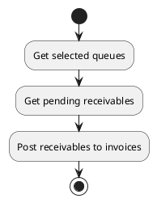
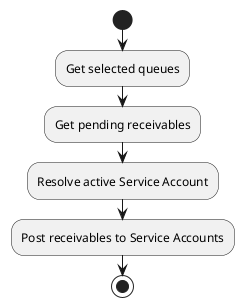

# Receivable queue actions

## Post invoice

Post pending receivables of selected queues to invoices.

Only receivables still in `pending` status are processed. If `invoice_id` is provided, it must reference a `proforma` invoice. If it is not provided, pending receivables are posted to each customer's existing `proforma` invoice, or to a newly created one when none exists.

### Params

| Param      | Type     | Required | Description                                                                                | Value(s) |
|------------|----------|:--------:|--------------------------------------------------------------------------------------------|----------|
| id         | integer  |          | Identifier of the targeted receivables queue.                                              |          |
| ids        | one2many |          | Identifiers of the targeted receivables queues.                                            |          |
| invoice_id | many2one |          | Proforma invoice to which the lines must be added. If left empty, one is found or created. | proforma |

### Uml

## Post Service Account

Post pending time-entry receivables of selected queues to Service Accounts.

Only receivables still in `pending` status are processed. If `service_account_id` is provided, it is used only for queues belonging to the same customer; other queues fall back to their customer's active Service Account. The target Service Account must be active.

This action delegates the actual posting checks to the receivable `post_service_account` action, including the requirement that each receivable originates from `timetrack\TimeEntry` and has a strictly positive billed duration.

### Params

| Param              | Type     | Required | Description                                                                  | Value(s) |
|--------------------|----------|:--------:|------------------------------------------------------------------------------|----------|
| id                 | integer  |          | Identifier of the targeted receivables queue.                                |          |
| ids                | one2many |          | Identifiers of the targeted receivables queues.                              |          |
| service_account_id | many2one |          | Active Service Account to use. If empty, each customer's active account is used. | active   |

### Uml

