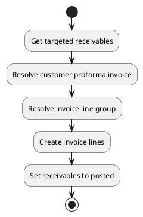
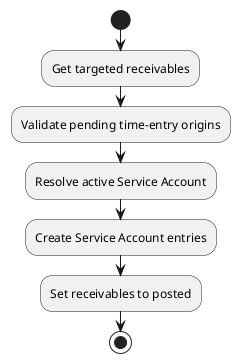
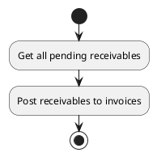

# Receivable actions

## Post invoice

Post one or more pending receivables to an invoice.

If `invoice_id` is provided, the invoice is used for receivables belonging to the same customer. If it is not provided, each receivable is posted to the customer's existing `proforma` invoice, or to a newly created `proforma` invoice when none exists.

The action creates invoice lines, links each receivable to its invoice and invoice line, then sets its status to `posted`.

### Params

| Param                   | Type     | Required | Description                                                                                     | Value(s) |
|-------------------------|----------|:--------:|-------------------------------------------------------------------------------------------------|----------|
| id                      | many2one |          | Identifier of the targeted receivable.                                                          |          |
| ids                     | one2many |          | Identifiers of the targeted receivables.                                                        |          |
| invoice_id              | many2one |          | Proforma invoice to which the lines must be added. If left empty, one is found or created.      | proforma |
| invoice_line_group_name | string   |          | Label for grouping lines on the invoice. If empty, `invoice_group` or a default label is used.  |          |

### Uml

## Post Service Account

Post one or more pending time-entry receivables to a Service Account.

This action is intended for receivables originating from `timetrack\TimeEntry`. The receivable must still be `pending`, must belong to a customer, and the source time entry must have a strictly positive billed duration.

If `service_account_id` is provided, it must be active and belong to the same customer as the receivable. If it is not provided, the customer's active Service Account is used.

The action creates Service Account entries, links each receivable to its Service Account and Service Account entry, then sets its status to `posted`.

### Params

| Param              | Type     | Required | Description                                                                  | Value(s) |
|--------------------|----------|:--------:|------------------------------------------------------------------------------|----------|
| id                 | many2one |          | Identifier of the targeted receivable.                                       |          |
| ids                | one2many |          | Identifiers of the targeted receivables.                                     |          |
| service_account_id | many2one |          | Active Service Account to use. If empty, the customer's active account is used. | active   |

### Uml

## Bulk invoice

Post all pending receivables to customer invoices.

### Uml

