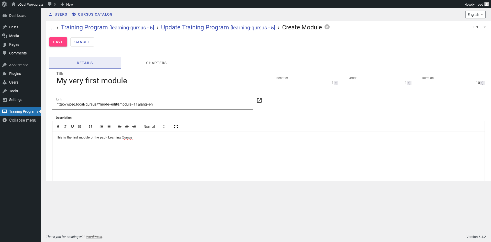
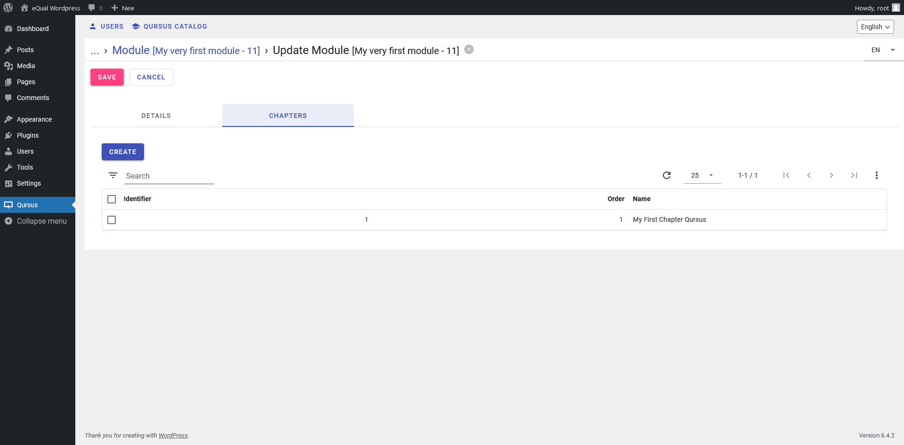

# Qursus

Qursus is a learning management system using eQual Framework.

## How it works

Qursus works with eQual on the back-end.

Courses are modeled as Packs that can hold several modules, each of which having several chapters (sections), each of
which having several pages.

The student can follow the lesson using the web app that is deployed in `/public` when the `qursus` package is initiated.

**UML Diagram of the application**


**Schema of the application**

A Qursus application contains one or several packs which can contain one or several modules which are themselves divided
into chapters and pages. Each page has sections and "leaves". Leaves are divided into groups of 8 spaces per leaf. Those
spaces can contain widgets. A widget can be a picture, a text, a title, some code excerpt... A pack can also have a
bundle which is basically a zipped piece of attachments (video, pictures, pdf files) the student can download and follow
the course.


## I / Installation

Prerequisite : To install Qursus, eQual should be installed. Go to
the [eQual documentation](https://doc.equal.run/getting-started/installation/) installation page.

Then navigate to your eQual in your docker or server instance. Then you need to add qursus to the packages. It is
currently located in the [symbiose repository on github](https://github.com/yesbabylon/symbiose) under the branch
dev-2.0. Fetch the repo in /packages then init the package qursus.

```bash
cd /var/www/html/
git clone https://github.com/yesbabylon/symbiose.git packages
cd /var/www/html/packages
git checkout dev-2.0
git pull
cd /var/www/html/
./equal.run --do=init_package --package=qursus
```

Now in your qursus package you should see :

```
/packages
    /qursus
        /actions
             import.php         --> Create Modules, Chapters, Leaves, Pages, Groups and Widgets based on ATModule.json file.
             next.php           --> Handle action from user when performing a click to see next page of a given module.
             survey.php         --> Send an invite to satisfaction survey.
        /apps
            /qursus             --> front-end in TypeScript and jQuery web.app that will be unpacked in /public/qursus on init
                export.sh       --> utility script for exporting the app to /public
                web.app         --> zip of the front-end build
                manifest.json
        /classes
            Bundle.class.php
            BundleAttachment.class.php
            Chapter.class.php
            Group.class.php
            Lang.class.php
            Leaf.class.php
            Module.class.php
            Pack.class.php
            Page.class.php
            Quiz.class.php
            Section.class.php
            UserAccess.class.php
            UserStatus.class.php
            Widget.class.php
        /data
            /module
                render.php      --> Returns a fully loaded JSON formatted single module
            /pack
                access.php      --> Checks if current user has a license for a given program.
                certificate.php --> Returns a html page or a signed pdf certificate.
                complete.php    --> Checks if a pack has been fully completed by current user.
                grant.php       --> Checks if current user has a license for a given program.
            bundle.php          --> Sends either a single attachment or a zip archive containing all attachments.
            module.php          --> Returns a fully loaded JSON formatted single module.
            modules.php         --> "Returns a list of all modules for a given pack, enriched with current user status.
        /init
            /data
        /views
            Bundle.list.default.json
            Bundle.form.default.json
            ...
            Widget.form.create.default.json
            Widget.form.default.json
            Widget.list.default.json
        config.inc.php          --> specify the DEFAULT_PACKAGE constant used for routing
        manifest.json           --> usual eQual package manifest
```

## II / Classes and Controllers

Fundamentally the qursus application can be schematized this way :

```bash
├─Pack
    ├─Lang
    ├─Bundle
        ├─BundleAttachment
    ├─Module
        ├─Chapter
            ├─Page
                ├─Section
                    ├─Page
                ├─Leaves
                    ├─Group
                        ├─Widgets

```


### Pack

A pack is at the basis of a Qursus. It has a title, a subtitle and languages it is available into. Some (learning)
modules will be attached to the pack. For example, the package **Learning eQual** could have modules called **back-end ,
front-end, low-code**.

To create a pack, go to the In the dashboard menu, select Pack and click on the button create. You should get a form and enter the title, the slug of the package which
should be unique. You can add a subtitle if you wish. Don't forget to click on the save button.

#### A pack is defined by :

| Property    | Type      | Description                                                                                                 |
|-------------|-----------|-------------------------------------------------------------------------------------------------------------|
| name        | unique    |                                                                                                             |
| title       | string    | The title is `multilang` so you can set a different one according to the language the pack is available in. |
| subtitle    | string    | This field is `multilang` so you can set a different one according to the language.                         |
| description | text      |                                                                                                             |
| modules     | alias     | Alias of modules_ids.                                                                                       |
| module_ids  | one2many  |                                                                                                             |
| quizzes_ids | one2many  |                                                                                                             |
| bundles_ids | one2many  |                                                                                                             |
| langs_ids   | many2many | Pack can have many languages and a language can be available in many packs.                                 |


If the pack is deleted, its associated modules are deleted too.

To create a pack or any other entity like a Module a Chapter you can also use the usual eQual controllers and replace by
the appropriate entity name and fields:
http://wpeq.local/equal.php/?do=model_create&entity=qursus\Pack&fields[state]=draft&lang=en

```bash
./equal.run --do=model_create --entity=qursus\Pack --fields[state]=draft --lang=en
```

You can the update this model.

The response should be:

```json
{
  "entity": "qursus\\Pack",
  "id": 6
}
```

You can update the Pack entries:

```bash
./equal.run --do=model_update --entity='qursus\Pack' --ids=6 --fields='{name:"slug-of-the-pack", title:"Title of the Pack", subtitle : "Subtitle of the Pack", description: "This is a basic description of what is taught in this pack. I can write the numbers and names of the modules and chapters etc." }'
```

**Response**

```json
[
  {
    "id": 6,
    "name": "slug-of-the-pack",
    "title": "Title of the Pack",
    "subtitle": " Subtitle of the Pack",
    "description": " This is a basic description of what is taught in this pack. I can write the numbers and names of the modules and chapters etc.",
    "langs_ids": " ",
    "modifier": 1,
    "state": "instance",
    "modified": "2023-12-19T10:25:58+00:00"
  }
]
```

Now you can check your newly updated pack by using eQual model_collect.

```bash
./equal.run --get=model_collect --entity='qursus\Pack' --domain=['id','=',6]

```

**Response**

```json
[
  {
    "id": 6,
    "name": "slug-of-the-pack",
    "state": "instance",
    "modified": "2023-12-19T10:28:02+00:00"
  }
]

```

### Languages

You can have a pack so a course available in one or several languages. They are defined by the Lang.class.php. A
language has a

| Property  | Type     | Description                                                                                 |
|-----------|----------|---------------------------------------------------------------------------------------------|
| name      | string   |                                                                                             |
| code      | string   | ISO 639-1 language code                                                                     |
| packs_ids | many2one | Relation many2one to the packs the language is used in <br><br> **Example :** ``[1, 2, 3]`` |

### Quiz

You can create one or many quizzes for a pack. When the pack is deleted so are its quizzes.
They are defined by the Quiz.class.php. A quiz has a

| Property   | Type     | Description                                                                                                                                            |
|------------|----------|--------------------------------------------------------------------------------------------------------------------------------------------------------|
| identifier | integer  |                                                                                                                                                        |
| name       | string   |                                                                                                                                                        |
| quiz-code  | integer  | Integer which is multilang language code.<br><br>**Example :** <ul><li> **1** for english</li> <li>**2** for french</li> <li>**3** for dutch</li></ul> |
| packs_ids  | many2one | Relation many2one to the packs the language is used. <br><br> **Example :** ``[1, 2, 3]``                                                              |

### Bundle and Bundle attachments

You can create one or many Bundles for a pack. When the pack is deleted so are its Bundles. Basically a Bundle is a zip
folder the student can download. It contains attachments files that are used to follow the course.
They are defined by the Bundle.class.php and BundleAttachment.class.php. A Bundle has a

| Property        | Type     | Description                                                                             |
|-----------------|----------|-----------------------------------------------------------------------------------------|
| name            | string   |                                                                                         |
| description     | string   |                                                                                         |
| attachments_ids | many2one | Relation many2one between the bundle and its attachments                                |
| packs_ids       | many2one | Relation many2one to the packs the bundle is used.<br><br> **Example :** ``[1 , 2, 3]`` |

When a bundle is deleted the attachment is removed to. A bundle attachment is defined by :

| Property    | Type     | Description                                                                                                                                                                                                             |
|-------------|----------|-------------------------------------------------------------------------------------------------------------------------------------------------------------------------------------------------------------------------|
| name        | string   |                                                                                                                                                                                                                         |
| url         | string   | The destination the file is.<br><br> **Example :** https://equal.local/qursus/assets/images/qursus.webp, <br> The url is `multilang` so you can set a different one according to the language the pack is available in. |
| bundles_ids | many2one | Relation many2one to the bundle the attachment is used                                                                                                                                                                  |

### Module

#### Definition of a Module :

A Module is a major part in the pack. It contains chapters. A Module is defined by :

| Property      | Type     | Description                                                                                                                   |
|---------------|----------|-------------------------------------------------------------------------------------------------------------------------------|
| identifier    | integer  | Unique identifier.                                                                                                            |
| title         | string   | Description of the module as presented to user.                                                                               |
| name          | unique   | Alias of the title.                                                                                                           |
| order         | integer  | The module position in the pack.                                                                                              |
| link          | computed | URL of the module visual editor. <br><br> Example: http://equal.local/qursus/?mode=edit&module=11&lang=en*                    |
| page_count    | computed | Total amount of pages in the module.                                                                                          |
| chapter_count | computed | Total amount of chapters in the module.                                                                                       |
| description   | text     | Description of the module content.                                                                                            |
| duration      | integer  | Indicative duration, in minutes, for completing the module.                                                                   |
| chapters      | alias    | Alias of ``chapters_ids``                                                                                                     |
| chapters_ids  | one2many | Relationship one2many between the module and its many chapters. <br><br>When the module is deleted, chapters are deleted too. |
| pack_id       | many2one | Relationship many2one between the module and its parent pack. <br><br>When the pack is deleted, modules are deleted too.      |

#### Creating a Module :

Select the pack you just created, and click on update you can add modules to it.



A module is a major part in your course. It will be divided into chapters and pages.

#### The modules controllers and actions :

If you want to visualize all modules of a given pack you can use the terminal and the qursus_modules controller or for
instance make a http request at http://equal.local?get=qursus_modules&pack_id=5 :

```bash
./equal.run --get=qursus_modules --pack_id=5

```

**Response**

```json
[
  {
    "identifier": 1,
    "title": "My very first module",
    "duration": 10,
    "description": "<p>This is the first module of the pack Learning Qursus.</p>",
    "page_count": 1,
    "name": "My very first module",
    "id": 11,
    // id to inform to get the module
    "state": "instance",
    "modified": "2023-12-18T16:11:11+00:00",
    "status": "not started",
    "percent": 0
  },
  {
    "identifier": 2,
    "title": "Module 2 of the Qursus course",
    "duration": 10,
    "description": "<p>Test</p>",
    "page_count": 0,
    "name": "Module 2 of the Qursus course",
    "id": 12,
    "state": "instance",
    "modified": "2023-12-19T11:54:07+00:00",
    "status": "not started",
    "percent": 0
  }
]
```

If you then want to see a given module content lets call the controller qursus_module and give it the param --id=11
which is the id of the first module:

```bash
./equal.run --get=qursus_module --id=11
```

**Response**

```json
{
  "id": 11,
  "identifier": 1,
  // first module created in the pack
  "order": 1,
  // order the module will be displayed at
  "title": "My very first module",
  "description": "<p>This is the first module of the pack Learning Qursus.<\/p>",
  "duration": 10,
  // duration of the module in minutes
  "pack_id": {
    // pack the module is part of
    "id": 5,
    "name": "learning-qursus",
    "title": "Learning Qursus",
    "subtitle": "with Qursus",
    "description": "<p>We add a new description. <\/p>",
    "langs_ids": [
      // languages the module is available in
      {
        "id": 1,
        "name": "English",
        "code": "en",
        "state": "instance",
        "modified": "2023-12-18T15:43:43+00:00"
      },
      {
        "id": 2,
        "name": "French",
        "code": "fr",
        "state": "instance",
        "modified": "2023-09-22T08:14:19+00:00"
      }
    ],
    "state": "instance",
    "modified": "2023-12-18T15:43:53+00:00"
  },
  "chapters": [
    // chapters in the module
    {
      "id": 42,
      "identifier": 1,
      "order": 1,
      "title": "My First Chapter Qursus",
      "pages": [
        {
          "id": 588,
          "identifier": 1,
          "order": 1,
          "next_active": "[]",
          "leaves": [
            {
              "id": 1313,
              "identifier": 1,
              "order": 1,
              "visible": "[]",
              "background_image": "",
              "background_stretch": false,
              "background_opacity": 0.5,
              "contrast": "light",
              "groups": [
                {
                  "id": 2077,
                  "identifier": 1,
                  "order": 1,
                  "direction": "vertical",
                  "row_span": 3,
                  "visible": "[]",
                  "fixed": false,
                  "widgets": [
                    {
                      "id": 2373,
                      "identifier": 1,
                      "order": 1,
                      "content": "<p><strong>Test of a <em>widget<\/em><\/strong><\/p>",
                      "type": "page_title",
                      "section_id": null,
                      "image_url": "",
                      "video_url": "",
                      "sound_url": "",
                      "has_separator_left": false,
                      "has_separator_right": false,
                      "align": "none",
                      "on_click": "ignore",
                      "state": "instance",
                      "modified": "2023-12-18T16:10:26+00:00"
                    }
                  ],
                  "state": "instance",
                  "modified": "2023-12-18T16:10:32+00:00"
                }
              ],
              "state": "instance",
              "modified": "2023-12-18T16:10:38+00:00"
            }
          ],
          "sections": [],
          "state": "instance",
          "modified": "2023-12-18T16:10:42+00:00"
        }
      ],
      "state": "instance",
      "modified": "2023-12-18T16:11:11+00:00"
    }
  ],
  "state": "instance",
  "modified": "2023-12-18T16:11:11+00:00"
}
```

### Chapter:

#### Definition of a Chapter:

A Chapter is a major part in the pack. It contains chapters. A chapter is defined by :

| Property          | Type     | Description                                                                                                                                                       |
|-------------------|----------|-------------------------------------------------------------------------------------------------------------------------------------------------------------------|
| identifier        | integer  | Unique identifier.                                                                                                                                                |
| order             | integer  | The chapter position in the pack.                                                                                                                                 |
| name              | alias    | Alias of the title.                                                                                                                                               |
| title  (required) | string   | Description of the chapter presented to user.                                                                                                                     |
| page_count        | computed | Total amount of pages in the chapter.                                                                                                                             |
| description       | text     | Content description of the chapter.                                                                                                                               |
| pages             | alias    | Alias of pages_ids                                                                                                                                                |
| pages_ids         | one2many | Relationship one2many between the chapter and its many pages.<br><br>When chapter is deleted, pages are deleted too.                                              |
| module_id         | many2one | Relationship many2one between the chapter and its parent module. Many chapters can be in one module. <br><br>When the module is deleted, chapters are deleted too |

There are functions for updating the page_count when the pages_ids is updated and/or if module_id is updated.



You can add a page at the same time.

## Page :

### Definition of a page:

A page is a part of a chapter. It can represent a lesson or an exercise for example. It contains leaves and sections.
Sections can contain a page which itself can contain other sections and leaves. A page is defined by :

| Property         | Type     | Description                                                                                                                                                                                                                                                                                                                                                                                                                                                                                                                                                                                                                                                                                              |
|------------------|----------|----------------------------------------------------------------------------------------------------------------------------------------------------------------------------------------------------------------------------------------------------------------------------------------------------------------------------------------------------------------------------------------------------------------------------------------------------------------------------------------------------------------------------------------------------------------------------------------------------------------------------------------------------------------------------------------------------------|
| identifier       | integer  | Unique identifier.                                                                                                                                                                                                                                                                                                                                                                                                                                                                                                                                                                                                                                                                                       |
| order            | integer  | The page position in the chapter.                                                                                                                                                                                                                                                                                                                                                                                                                                                                                                                                                                                                                                                                        |
| next_active      | computed | JSON formatted array of visibility domain for 'next' button.                                                                                                                                                                                                                                                                                                                                                                                                                                                                                                                                                                                                                                             |
| title (required) | string   | Description of the page as presented to user.                                                                                                                                                                                                                                                                                                                                                                                                                                                                                                                                                                                                                                                            |
| next_active_rule | string   | Select field with the following options:<br><br>**selection:**<ul><li>'always visible'            => 'always visible'</li><li>'$page.submitted = true'    => 'page submitted'</li><li>'$page.selection > 0'       => 'item selected'</li><li>'$page.actions_counter > 0' => '1 or more actions'</li><li>'$page.actions_counter > 1' => '2 or more actions'</li><li>'$page.actions_counter > 2' => '3 or more actions'</li><li>'$page.actions_counter > 3' => '4 or more actions'</li><li>'$page.actions_counter > 4' => '5 or more actions'</li><li>'$page.actions_counter > 5' => '6 or more actions'</li><li>'$page.actions_counter > 6' => '7 or more actions'</li></ul>**default:** 'always visible' |
| leaves           | alias    | Alias of leaves_ids.                                                                                                                                                                                                                                                                                                                                                                                                                                                                                                                                                                                                                                                                                     |
| leaves_ids       | one2many | Relationship one2many. A page can have many leaves. Leaves are deleted when the page is detached.                                                                                                                                                                                                                                                                                                                                                                                                                                                                                                                                                                                                        |
| sections         | alias    | Alias of section_ids                                                                                                                                                                                                                                                                                                                                                                                                                                                                                                                                                                                                                                                                                     |
| sections_ids     | one2many | Relationship one2many between the page and its many sections. If the page is detached, the sections are deleted too.                                                                                                                                                                                                                                                                                                                                                                                                                                                                                                                                                                                     |
| section_id       | many2one | Relationship many2one between the section and its many pages. If the page is deleted, the sections are deleted too.                                                                                                                                                                                                                                                                                                                                                                                                                                                                                                                                                                                      |
| chapter_id       | many2one | Relationship many2one between the page and its parent chapter. Many pages can be in one chapter. When the chapter is deleted so are its pages. When the chapter_id is updated, the ``$page['chapter_id']`` is also updated to match the new value.                                                                                                                                                                                                                                                                                                                                                                                                                                                       |

A page usually contains two leaves. Pages are displayed flex row with one leaf on the left and a second one on the
right.

## Leaf

Since you can add actions and conditions on visibility.The second leaf's visibility often results of actions from the
user. Those actions are transmitted in the **context**.

A leaf is defined by :

| Property           | Type     | Description                                                                                                                                                                                                                                                                                                                                                                            |
|--------------------|----------|----------------------------------------------------------------------------------------------------------------------------------------------------------------------------------------------------------------------------------------------------------------------------------------------------------------------------------------------------------------------------------------|
| identifier         | integer  | Unique identifier.                                                                                                                                                                                                                                                                                                                                                                     |
| order              | integer  | The position of the leaf in the page.                                                                                                                                                                                                                                                                                                                                                  |
| visible            | computed | Visibility of the leaf on the page                                                                                                                                                                                                                                                                                                                                                     |
| visibility_rule    | string   | Select field with the following options:<br><br>**selection:**<ul><li>'always visible'                    => 'always visible'</li><li>'$page.selection = $identifier'     => 'selection matches identifier'</li><li>'$page.submitted = true'            => 'page submitted'</li><li>'$page.submitted = false'           => 'page not submitted'</li></ul>**Default:** 'always visible' |
| groups             | alias    | Alias of groups_ids                                                                                                                                                                                                                                                                                                                                                                    |
| groups_ids         | one2many | Relation one2many, a leaf can have many groups. When detached the group is deleted.                                                                                                                                                                                                                                                                                                    |
| background_image   | string   | URL of the background image.                                                                                                                                                                                                                                                                                                                                                           |
| background_stretch | boolean  | **Default:** ``false``                                                                                                                                                                                                                                                                                                                                                                 |
| background_opacity | float    | Opacity of the background (from 0 to 1).                                                                                                                                                                                                                                                                                                                                               |
| contrast           | string   | Select field with ``dark`` or ``light`` options for the background of the leaf.                                                                                                                                                                                                                                                                                                        |
| page_id            | many2one | Relation many2one between the leaf and the page. Many leaves can be in one page.                                                                                                                                                                                                                                                                                                       |


## Section

A Section is defined by :

| Property   | Type     | Description                                                                                                                                               |
|------------|----------|-----------------------------------------------------------------------------------------------------------------------------------------------------------|
| identifier | integer  | Unique identifier.                                                                                                                                        |
| order      | integer  | The position of the section in the page.                                                                                                                  |
| name       | string   | Computed field result type string, stored: getDisplayName made of the section_id (in the example 65) and the  section_identifier (here 1) *example 65-1*. |
| pages      | alias    | Alias of pages_ids                                                                                                                                        |
| pages_ids  | one2many | Relation one2many, one section can contain many pages. If the section is detached, pages it deleted.                                                      |
| page_id    | many2one | Relation many2one where many sections can be in one page. When the parent page is deleted the sections are deleted too.                                   |

## Group

A leaf can contain one or several groups. A group will take 1 to a maximum of 8 rows in the leaf. The group will contain
widgets.

A Group is defined by :

| Property        | Type          | Description                                                                                                                                                                                                                                                                                                                                                                                                                                                                                                                                                                                                                                                                                      |
|-----------------|---------------|--------------------------------------------------------------------------------------------------------------------------------------------------------------------------------------------------------------------------------------------------------------------------------------------------------------------------------------------------------------------------------------------------------------------------------------------------------------------------------------------------------------------------------------------------------------------------------------------------------------------------------------------------------------------------------------------------|
| identifier      | integer       | Unique identifier of the group.<br><br>When updated, it triggers onupdateVisibility which sets the field visible to null and triggers calcVisible for the field visibility.                                                                                                                                                                                                                                                                                                                                                                                                                                                                                                                      |
| order           | integer       | The position of the group in the leaf.                                                                                                                                                                                                                                                                                                                                                                                                                                                                                                                                                                                                                                                           |
| direction       | string        | Direction of the group can be either ``vertical`` or ``horizontal``.<br><br> **Default:** ``vertical``.                                                                                                                                                                                                                                                                                                                                                                                                                                                                                                                                                                                          |
| row_span        | integer       | Height of the group between default 1 and max 8.                                                                                                                                                                                                                                                                                                                                                                                                                                                                                                                                                                                                                                                 |
| visible         | computed      | Computed result type string, it is calculated by ``calcVisible`` function.                                                                                                                                                                                                                                                                                                                                                                                                                                                                                                                                                                                                                       |
| visibility_rule | select/string | Select fields with the folling options:<br><ul><li>'always visible'            => 'always visible'</li><li>'$page.submitted = true'    => 'page submitted'</li><li>'$page.selection > 0'       => 'item selected'</li><li>'$page.actions_counter > 0' => '1 or more actions'</li><li>'$page.actions_counter > 1' => '2 or more actions'</li><li>'$page.actions_counter > 2' => '3 or more actions'</li><li>'$page.actions_counter > 3' => '4 or more actions'</li><li>'$page.actions_counter > 4' => '5 or more actions'</li><li>'$page.actions_counter > 5' => '6 or more actions'</li><li>'$page.actions_counter > 6' => '7 or more actions'</li></ul><br><br>**Default: ** ``always visible`` |
| fixed           | boolean       | If true the group is always visible                                                                                                                                                                                                                                                                                                                                                                                                                                                                                                                                                                                                                                                              |
| widgets         | alias         | Alias of widgets_ids                                                                                                                                                                                                                                                                                                                                                                                                                                                                                                                                                                                                                                                                             |
| widgets_ids     | one2many      | Relation one2many. One group can have many widgets.                                                                                                                                                                                                                                                                                                                                                                                                                                                                                                                                                                                                                                              |
| leaf_id         | many2one      | Relation many2one. There can be many groups in a leaf.                                                                                                                                                                                                                                                                                                                                                                                                                                                                                                                                                                                                                                           |

calcVisible retrieves data from the Group collection. Then depending on the value set in visibility_rule it will return
either [] or a condition that will be implemented as a domain in the view.

You can then see it in the GroupClass::render under visible:[]


## Widget

A widget is a what you student will see. It can be a text, an excerpt of code, a chapter title, a video, a sound, an
image, a selector


**Example of a Widget**

```json
{
  "widgets": [
    {
      "id": 2373,
      "identifier": 1,
      "order": 1,
      "content": "<p><strong>Test of a <em>widget<\/em><\/strong><\/p>",
      "type": "page_title",
      "section_id": null,
      "image_url": "",
      "video_url": "",
      "sound_url": "",
      "has_separator_left": false,
      "has_separator_right": false,
      "align": "none",
      "on_click": "ignore",
      "state": "instance",
      "modified": "2023-12-18T16:10:26+00:00"
    }
  ]
}
```

| Property            | Type          | Description                                                                                                                                                                                                                                                                                                                                                                                                                                                                                                                                    |
|---------------------|---------------|------------------------------------------------------------------------------------------------------------------------------------------------------------------------------------------------------------------------------------------------------------------------------------------------------------------------------------------------------------------------------------------------------------------------------------------------------------------------------------------------------------------------------------------------|
| identifier          | integer       | Unique identifier of the group on the leaf.<br><br>When updated, it triggers onupdateVisibility which sets the field visible to null and triggers calcVisible for the field visibility.                                                                                                                                                                                                                                                                                                                                                        |
| order               | integer       | The widget position in the group.                                                                                                                                                                                                                                                                                                                                                                                                                                                                                                              |
| content             | text          | Content of the widget in text with markdown support.                                                                                                                                                                                                                                                                                                                                                                                                                                                                                           |
| group_id            | many2one      | Relation many2one, many widget can be in one group. When the parent group is deleted, the widgets are deleted too.                                                                                                                                                                                                                                                                                                                                                                                                                             |
| type                | select/string | Select field with the following options: <br><ul><li>text</li><li>code</li><li>chapter_number</li><li>chapter_title</li><li>chapter_description</li><li>page_title</li><li>headline</li><li>subtitle</li><li>head_text</li><li>tooltip</li><li>sound</li><li>video</li><li>image_popup</li><li>first_capital</li><li>submit_button</li><li>selector</li><li>selector_wide</li><li>selector_yes_no</li><li>selector_choice</li><li>selector_section</li><li>selector_section_wide</li><li>selector_popup</li></ul><br><br>**Default:** ``text`` |
| section_id          | integer       | The widget can interact with a section depending on if the widget is of type ``selector_section`` or ``selector_section_wide``.                                                                                                                                                                                                                                                                                                                                                                                                                |
| image_url           | string        | The widget may need a url if of type : ``image_popup``, ``selector_popup``, ``selector_section``, ``selector_section_wide``                                                                                                                                                                                                                                                                                                                                                                                                                    |
| video_url           | string        | The widget may need a url if of type ``video``                                                                                                                                                                                                                                                                                                                                                                                                                                                                                                 |
| sound_url           | string        | The widget may need a url if of type ``sound``                                                                                                                                                                                                                                                                                                                                                                                                                                                                                                 |
| has_separator_left  | Boolean       |                                                                                                                                                                                                                                                                                                                                                                                                                                                                                                                                                |
| has_separator_right | Boolean       |                                                                                                                                                                                                                                                                                                                                                                                                                                                                                                                                                |
| on_click            | select/string | Select field with the following options:<br><br><ul><li>'ignore'        => 'do nothing'</li><li>'select_one()'  => 'select'</li><li>'submit()'      => 'submit'</li><li>'image_full()'  => 'show image'</li><li>'play()'        => 'play media'</li></ul><br>**Default:** ``ignore``                                                                                                                                                                                                                                                           |

## UserAccess

This class is responsible for the user access to the app. The idea is that a student user receives a code with a link to
connect to Qursus webapp.

It is defined by :

| Property       | Type     | Description                                                                                                                                                             |
|----------------|----------|-------------------------------------------------------------------------------------------------------------------------------------------------------------------------|
| code           | computed | Computed result type integer function getCode : a unique identifier used for generating verification url.                                                               |
| code_alpha     | computed | Computed result type string function getCodeAlpha: retrieve the pack based on verification url code of 4 chars (3 letters + 1 digit).                                   |
| pack_id        | many2one | Relation many2one, many users can access one pack.                                                                                                                      |
| master_user_id | integer  | In case of multi-accounts, external user id.                                                                                                                            |
| user_id        | integer  | External user identifier that is granted access.                                                                                                                        |
| is_complete    | computed | Computed result type ``boolean``, function ``getIsComplete`` : The user has finished the programs modules from the UserStatus the value is_complete is set to ``true``. |

### How to generate a User Code ?

## UserStatus

It is defined by :

| Property      | Type     | Description                                                                                                |
|---------------|----------|------------------------------------------------------------------------------------------------------------|
| pack_id       | many2one | Relation many2one, many UserStatus can be in one pack. It is used to determine the completeness of a pack. |
| module_id     | many2one | Relation many2one, many UserStatus can be in one Module.                                                   |
| user_id       | integer  | External user identifier that is granted access                                                            |
| chapter_index | integer  | Chapter index/identifier within the module.                                                                |
| page_index    | integer  | Page index/identifier within the module.                                                                   |
| page_count    | integer  | Number of pages reviewed so far by the user.                                                               |
| is_complete   | boolean  | ``true`` if the user has finished the module.                                                              |

It has two methods : getUnique that returns ``['module_id','user_id']`` and onupdate is complete which will set
is_complete to true if the user has completed all modules.

## Context :

Group : Context :

```json
{
  "context": {
    "actions_counter": 0
  },
  "mode": "view"
}
```

Check the typescript syntax (lint):

`yarn run tsc`

Use babel to transpile .ts file into .js :

`npm run build`

Generate an app.bundle.js that can be embedded to any .html file:

`npm run webpack`# Building an ERP that suits you

## Symbiose suite of apps for eQual

Symbiose is a set of Business Applications components intended for Agile organizations, made to fit the needs of any
business logic in an ever-changing marketplace.
It is a collection of packages designed to operate within the eQual framework, defining business entities by assembling
models, views, controllers, and the related applicative logic.

Its highly customizable back-end logic and its versatile user interface configuration allow fast development of
tailor-made applications on any type of device.

### Installation

#### Prerequisite

Symbiose requires [eQual framework](https://github.com/equalframework/equal).

#### Setup

This is the dev-2.0 version.

Under the root directory of your eQual installation, run the following command:

```bash
curl https://raw.githubusercontent.com/yesbabylon/symbiose/dev-2.0/install.sh
```

Note: The source of that script is available
here : [install.sh](https://github.com/yesbabylon/symbiose/blob/dev-2.0/install.sh)